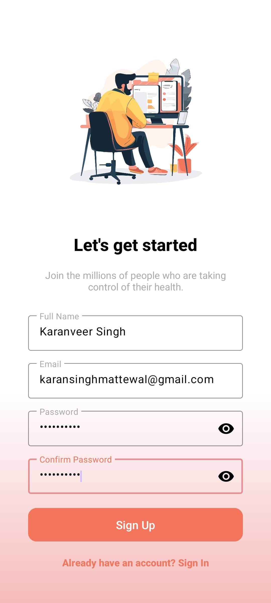
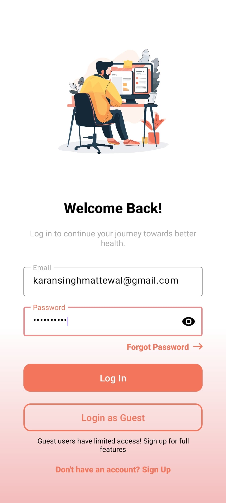
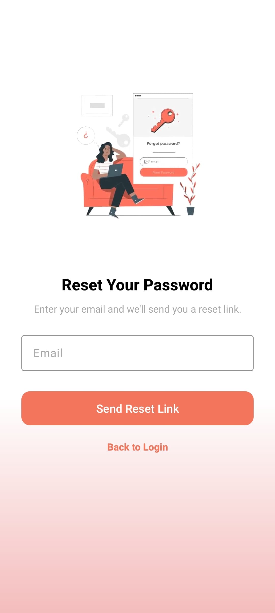
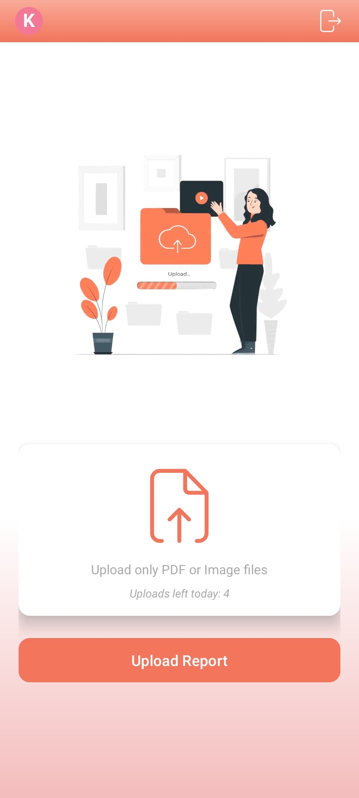
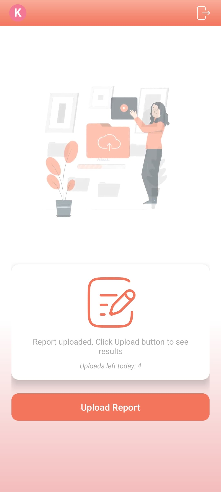
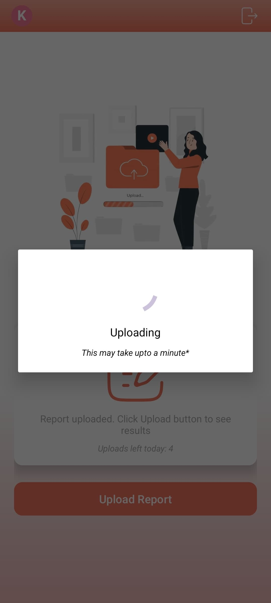
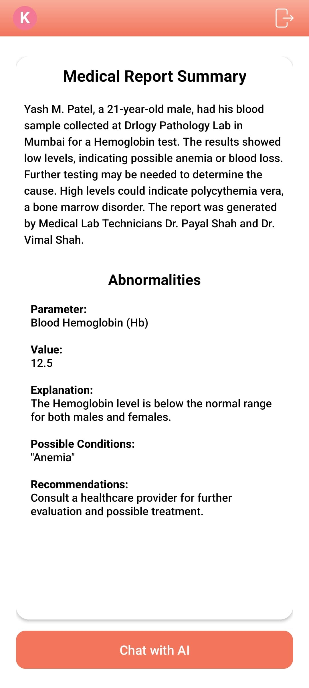
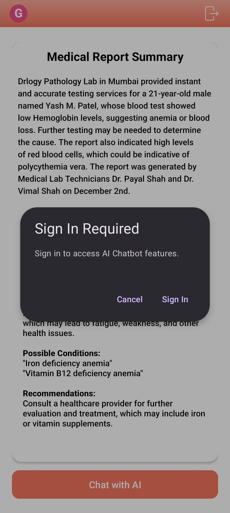

# MedXpert-FrontEnd

Welcome to **MedXpert-FrontEnd**, the Android application of the **MedXpert** system. MedXpert is a smart medical report analysis platform designed to simplify complex medical documents, highlight abnormal readings, and provide users with a clear, easy-to-understand health summary.

This repository contains the full Android app codebase for the MedXpert system, responsible for interacting with users and displaying simplified medical insights retrieved from the backend.

---

## 🏥 Problem Statement & Why MedXpert is Useful

### **The Challenge:**
Understanding medical reports can be challenging for non-medical professionals. Many patients struggle to interpret complex test results, abnormal values, and medical terminology. Additionally, doctors often have limited time to explain reports in detail, leaving patients uncertain about their health conditions.

---

## 🚀 How MedXpert Solves This Problem

### Backend:
The backend of MedXpert is responsible for handling the heavy lifting of medical report analysis. It performs the following tasks:

- ✅ **Extracts Medical Data**: Utilizes advanced OCR technologies like Tesseract and pdfplumber to accurately extract text from PDF and image-based medical reports.
- ✅ **Summarizes Medical Jargon**: Processes complex medical terminologies and converts them into simplified, understandable summaries using AI-powered language models (OpenAI GPT-3.5).
- ✅ **Detects Abnormal Readings**: Scans for abnormal values within the report and highlights potential health concerns through AI-driven analysis.
- ✅ **Powers the Chatbot**: Provides instant, reliable answers to user queries about their medical reports by leveraging LLM (Large Language Model)-based responses.

---

### Frontend:
The frontend of MedXpert provides a seamless and user-friendly Android interface for interacting with the backend features. It handles:

- ✅ **User-Friendly Interface**: Designed to ensure even non-technical users can easily upload reports and view results.
- ✅ **Report Upload & Results Display**: Allows users to submit their reports and receive a detailed analysis and summary of the findings.
- ✅ **Abnormality Highlighting**: Visually marks abnormal values within the summary to help users quickly identify areas of concern.
- ✅ **User Role Management**: Manages user authentication (guest and logged-in users) and enforces usage limits.
- ✅ **Chatbot Interaction**: Facilitates communication with the backend chatbot for personalized health insights and explanations.

---

### ✅ MedXpert makes medical understanding accessible and actionable by:
- ✅ Providing an intuitive Android app interface.
- ✅ Allowing users to upload reports and view summaries.
- ✅ Displaying highlighted abnormalities visually.
- ✅ Managing user roles, limits, and chatbot interactions.

---


## 🌐 Live Demo

▶️ **Click the image below to watch the full demo video:**

[](https://youtu.be/-8R1s6liwyo)

---


## ⚙️ Features

- **User authentication (Guest & Logged-in users)**  
  <div style="display: flex; gap: 20px;">
  
  
  
</div>

  ```kotlin
// ✅ Signup
FirebaseAuth.getInstance()
    .createUserWithEmailAndPassword(email, password)
    .addOnCompleteListener { task ->
        if (task.isSuccessful) {
            // Signup success
        } else {
            // Signup failed
        }
    }

// ✅ Signin
FirebaseAuth.getInstance()
    .signInWithEmailAndPassword(email, password)
    .addOnCompleteListener { task ->
        if (task.isSuccessful) {
            // Signin success
        } else {
            // Signin failed
        }
    }

// ✅ Forgot Password
FirebaseAuth.getInstance()
    .sendPasswordResetEmail(email)
    .addOnCompleteListener { task ->
        if (task.isSuccessful) {
            // Reset email sent
        } else {
            // Failed to send reset email
        }
    }
```

- **Upload medical reports (PDF/Image formats)**

  <div style="display: flex; gap: 20px;">
  
  
  
</div>


  ```kotlin
  val intent = Intent(Intent.ACTION_GET_CONTENT)
  intent.type = "application/pdf"
  startActivityForResult(intent, REQUEST_CODE)
  ```

- **View simplified summaries  and abnormalities of your reports**  
  <div style="display: flex; gap: 20px;">
  

</div>
  
  ```kotlin
  summaryTextView.text = "Summary: ${viewModel.summary}"
  ```


- **Usage limits based on user roles**:
   
  - **Logged-in Users** (Limit: 5 uploads per day and 10 chabot queries per day):  
    ```kotlin
    if (user.isLoggedIn && dailyUploads >= 10) showLimitReached()
    ```
  - **Guest Users** (Limit: 2 uploads per day and not chabot access):
    ```kotlin
    if (user.isGuest && dailyUploads >= 2) showLimitReached()
    ```
  
  <div style="display: flex; gap: 20px;">
  
</div>

- **Integrated chatbot**  
  <div style="display: flex; gap: 20px;">
  
  
</div>

---


## 🛠️ Tech Stack

| Technology              | Description                                                                                   |
|-------------------------|-----------------------------------------------------------------------------------------------|
| **Platform**            | Android (**Kotlin**) – A modern, concise, and powerful statically typed programming language. |
| **UI Design**           | XML Layouts – Declarative UI component design for seamless user experiences.                  |
| **State Management**    | ViewModel + LiveData – Lifecycle-aware components to handle and observe UI-related data.      |
| **Authentication**      | Firebase Authentication – Secure, scalable user sign-in and account management.               |
| **Backend Integration** | OkHttp – Efficient and powerful HTTP client for handling API communication.                   |
| **Cloud Services**      | Firebase – Realtime database, storage, analytics, and backend services.                       |
| **Deployment**          | Google Play Store *(coming soon)* – For global Android app distribution.                      |

---


### 🔄 Example Integrations:

#### OkHttp Setup:
```kotlin
val client = OkHttpClient()

val request = Request.Builder()
    .url("https://api.medxpert.com/")
    .build()

client.newCall(request).enqueue(object : Callback {
    override fun onFailure(call: Call, e: IOException) {
        // Handle failure
    }

    override fun onResponse(call: Call, response: Response) {
        // Handle response
    }
})
```

#### Firebase Authentication:
```kotlin
FirebaseAuth.getInstance().signInWithEmailAndPassword(email, password)
    .addOnCompleteListener { task ->
        if (task.isSuccessful) {
            // User signed in successfully
        }
    }
```

---


## 📂 Project Structure

```
MedXpert/
├── manifests/
│   └── AndroidManifest.xml            # Defines essential app configurations and permissions.
├── java/
│   └── com.example.medxpert
│       ├── adapters/                  # Handles data population in RecyclerViews.
│       │   ├── ChatAdapter.kt         # Manages chat messages display.
│       │   ├── ReportAdapter.kt       # Manages report items in a list.
│       │   └── UserAdapter.kt         # Manages user list and interactions.
│       ├── fragments/                 # Modular UI components for various screens.
│       │   ├── ChatBotFragment.kt     # Chat interface with the medical assistant.
│       │   ├── ChatIntroFragment.kt   # Introduction to chatbot features.
│       │   ├── ResultsFragment.kt     # Displays analyzed medical report results.
│       │   └── UploadFragment.kt      # Handles medical report upload.
│       ├── models/                    # Data classes used across the app.
│       │   ├── Report.kt              # Represents a medical report structure.
│       │   ├── User.kt                # Represents user profile information.
│       │   └── Message.kt             # Represents chat message data.
│       ├── DashBoardActivity.kt       # Post-login dashboard.
│       ├── ForgotPasswordActivity.kt  # Allows users to recover passwords.
│       ├── MainActivity.kt            # App's main entry point handling navigation.
│       ├── ProfileActivity.kt         # Displays and updates user profile.
│       ├── SignInActivity.kt          # Manages login functionality.
│       ├── SignUpActivity.kt          # Handles user registration.
│       └── SplashActivity.kt          # Displays splash screen on app startup.
├── res/
│   ├── drawable/                      # Contains image assets and vector graphics.
│   ├── layout/                        # Holds all XML UI layout files.
│   ├── activity_dash_board.xml        # Layout for the dashboard screen.
│   ├── activity_forgot_password.xml   # Layout for password recovery.
│   ├── activity_main.xml              # Main container layout.
│   ├── activity_profile.xml           # User profile screen layout.
│   ├── activity_sign_in.xml           # Login screen layout.
│   ├── activity_sign_up.xml           # Registration screen layout.
│   ├── activity_splash.xml            # Splash screen layout.
│   ├── dialog_loading.xml             # Loading dialog layout.
│   ├── dialog_reset_success.xml       # Success dialog after password reset.
│   ├── dialog_verification.xml        # Verification dialog layout.
│   ├── fragment_chat_bot.xml          # ChatBot UI layout.
│   ├── fragment_chat_intro.xml        # Intro screen for chatbot.
│   ├── fragment_results.xml           # Displays report results.
│   ├── fragment_upload.xml            # Upload report screen layout.
│   ├── item_chat_ai.xml               # Layout for AI chat messages.
│   └── item_chat_user.xml             # Layout for user chat messages.
│   ├── mipmap/                        # App launcher icons.
│   ├── raw/                           # Stores raw assets like instructional videos.
│   └── values/                        # XML files for app-wide constants (strings, colors, themes).
├── build.gradle.kts                   # Gradle build script for project dependencies and settings.
├── proguard-rules.pro                 # Rules for code obfuscation and optimization.
├── google-services.json               # Firebase configuration file.
└── README.md                          # Project documentation.
```

---


## 🚀 Installation

### 1. Clone the repository

To clone the project repository, use the following commands:

```bash
git clone https://github.com/JaspreetSingh-exe/MedXpert-FrontEnd.git
cd MedXpert-FrontEnd
```

### 2. Open in Android Studio

Follow these steps to open the project:
- Launch **Android Studio**.
- Select **Open an existing project**.
- Navigate to the cloned directory and select the project.

### 3. Setup environment

Ensure the following configurations:
- Add your Firebase configuration file `google-services.json` to the `/app` directory.
- Connect your project with Firebase through the Firebase Console.
- Define your backend API endpoints in the appropriate service classes.

### 4. Add api_url in `strings.xml`
```xml
<resources>
    <string name="api_url">https://api.medxpert.com/</string>
</resources>
```

### 5. Build and run

To run the project:
- Click on the **Run** button or use the shortcut `Shift + F10`.
- Choose a connected device or emulator for testing.

---


## 📁 Backend Integration

The MedXpert Android app communicates with the MedXpert Backend API to provide the core functionalities of the application. The backend processes and returns the necessary data, and the frontend handles the presentation and interaction.

### 🔄 How the Backend Works with the Frontend:

- **Medical Report Analysis**: When a user uploads a report, the frontend sends the file via an HTTP request to the backend. The backend performs OCR and text extraction, then analyzes the data to detect abnormalities and generate summaries.

- **Summary Generation**: The backend uses AI-powered language models to convert complex medical data into simplified summaries and returns them to the frontend for display.

- **Usage Management**: The backend tracks the number of uploads and chatbot interactions per user and enforces daily usage limits.

- **Chatbot Integration**: The chatbot interface on the app sends user queries to the backend, which generates intelligent, context-aware responses using LLMs.

### 🔗 Backend Repository
👉 [MedXpert-Backend Repository](https://github.com/JaspreetSingh-exe/MedXpert-Backend-FastAPI)

---

## 🧩 Future Improvements

### 🔹 Dark Mode
Introduce a dark theme option to reduce eye strain and provide a comfortable user experience in low-light conditions.

### 🔹 Upload History and Tracking
Add functionality for users to access and manage a history of their uploaded reports, enabling easy review and re-analysis.

### 🔹 Multi-language Support
Implement support for multiple languages to make the app accessible to a global user base, breaking language barriers in healthcare.

### 🔹 Offline Support
Allow users to view previously analyzed reports and summaries without needing an active internet connection.

---   


## 🤝 Open for Contributions
We welcome contributions from developers and UI/UX designers to enhance the MedXpert Application! If you would like to contribute, here’s how you can help:

### **How to Contribute**
1. **Fork the Repository**: Click on the "Fork" button at the top right of this repository.
2. **Clone Your Fork**: Clone the repository to your local machine.
   ```bash
   git clone https://github.com/JaspreetSingh-exe/MedXpert-FrontEnd.git
   cd MedXpert-FrontEnd
   ```
3. **Create a New Branch**: Make sure to create a new branch for your changes.
   ```bash
   git checkout -b feature-new-enhancement
   ```
4. **Make Your Changes**: Add new features, fix bugs, or improve documentation.
5. **Commit and Push**: Commit your changes and push to your fork.
   ```bash
   git add .
   git commit -m "Added a new feature"
   git push origin feature-new-enhancement
   ```
6. **Create a Pull Request**: Submit a pull request (PR) to the `main` branch of this repository.

### **Guidelines for Contributions**
- Follow best practices for **code structure, comments, and documentation**.
- Ensure that your code **passes all tests and does not break existing functionality**.
- If adding a new feature, please **update the documentation accordingly**.
- Be **respectful and collaborative** when reviewing and discussing PRs.

Join me in making **MedXpert a powerful and intelligent AI-based medical report analyzer**! 🚀

---

## 📞 Support
If you encounter any issues, feel free to create an issue on GitHub.   
For any queries reach out at `jaspreetsingh01110@gmail.com`

---

## 📜 License
This project is licensed under the **Apache License 2.0**. See `LICENSE` for details.

---

> ⭐ Don't forget to **star** this repo if you like the project!
